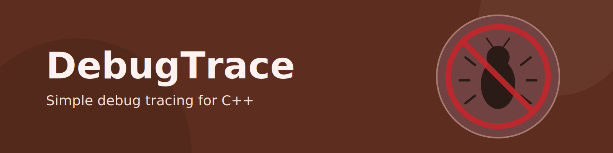

# DebugTrace

Header-only debug tracing macros for quick, low-friction diagnostics in C++.

## Purpose

`DebugTrace` gives you simple macros that print:
- file name
- line number
- function name
- optional process ID
- up to 3 labeled variable values

Tracing is compile-time gated:
- enabled when `DO_TRACE_` or `ENABLE_DEBUG_TRACE` is defined
- compiled to no-op output when neither is defined

# Installation

The installation and build is tested on *ubuntu24.04 LTS*

## dependencies

## use cmake to install the header-only library

```bash
# change the next line to change the install prefix to your liking
INSTALL_PREFIX=/usr
mkdir ./build
cd build
cmake -Wno-dev -DCMAKE_INSTALL_PREFIX=${INSTALL_PREFIX} ..
cmake --build . --parallel $(nproc)
sudo cmake --install .
```

This will install the headers from the include-folder to `${INSTALL_PREFIX}/dkyb`

To use the headers in your code, make sure `${INSTALL_PREFIX}` is in your include directories.

## Examples

### Basic usage (enabled)

```c++
#define DO_TRACE_
#include <dkyb/traceutil.h>

int add(int a, int b) {
    int sum = a + b;
    TRACE2(a, b);
    TRACE1(sum);
    return sum;
}
```

### Process-aware tracing

```c++
#define DO_TRACE_
#include <dkyb/traceutil.h>

void worker(int jobId) {
    PTRACE1(jobId); // includes PID in output
}
```

### Build-flag enable (no source define)

```bash
g++ -std=c++23 -DENABLE_DEBUG_TRACE main.cpp -o app
```

```c++
#include <dkyb/traceutil.h>

int main() {
    int x = 42;
    TRACE1(x);
}
```

### Macro reference

- `TRACE0`, `TRACE1(v1)`, `TRACE2(v1, v2)`, `TRACE3(v1, v2, v3)`
- `PTRACE0`, `PTRACE1(v1)`, `PTRACE2(v1, v2)`, `PTRACE3(v1, v2, v3)` (`P*` variants include PID)

## Powered by
Reduce the smells, keep on top of code-quality. Sonar Qube is run on every push to the `main` branch on GitHub.


[](https://sonarcloud.io/project/overview?id=kingkybel)
